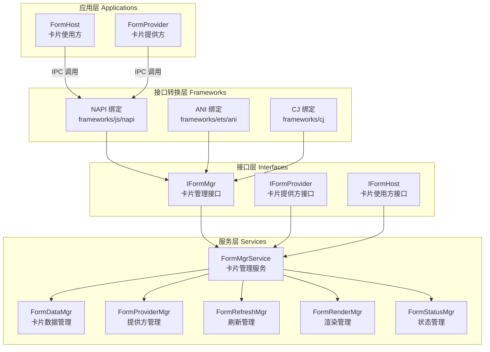

## 项目概述

这是一个 OpenHarmony 系统的卡片管理框架（form_fwk），提供卡片创建、删除、释放、更新等能力。卡片是一种界面展示形式，可以将应用的重要信息或操作前置到卡片，以达到服务直达的目的。

### 核心概念

- **卡片提供方（Form Provider）**：提供卡片显示内容的原子化服务，定义卡片的显示内容、控件布局以及控件点击事件
- **卡片使用方（Form Host）**：显示卡片内容的应用，可自由配置应用中卡片展示的位置
- **卡片管理服务（Form Manager Service）**：管理系统中所添加卡片的常驻代理服务，管理卡片的生命周期，维护卡片信息以及卡片事件的调度

## 构建和测试命令

### 构建命令

```bash
# 构建整个组件
./build.sh --product-name <产品名> --build-target form_fwk

# 构建服务目标
./build.sh --product-name <产品名> --build-target //foundation/ability/form_fwk:fms_services_target

# 构建框架目标
./build.sh --product-name <产品名> --build-target //foundation/ability/form_fwk:fms_innerkits_target
```

### 测试命令

```bash
# 运行所有单元测试
./build.sh --product-name <产品名> --build-target //foundation/ability/form_fwk/test:unittest

# 运行所有模糊测试
./build.sh --product-name <产品名> --build-target //foundation/ability/form_fwk/test/fuzztest:fuzztest

# 运行性能测试
./build.sh --product-name <产品名> --build-target //foundation/ability/form_fwk/test:benchmarktest

# 运行单个单元测试（示例：form_mgr_test）
./build.sh --product-name <产品名> --build-target //foundation/ability/form_fwk/test/unittest/form_mgr_test:unittest

# 运行测试
./test/unittest/form_mgr_test/FmsFormMgrTest
```

## 高层架构

### 分层架构



### 核心服务类
- 详细介绍参考 [服务层说明文档](services/CLAUDE.md)

## 关键文件位置

### 服务入口点
- `services/src/form_mgr/form_mgr_service.cpp` - FormMgrService 主服务类
- `services/src/form_mgr/form_mgr_adapter.cpp` - FormMgrAdapter 适配器
- `services/src/form_mgr/form_mgr_queue.cpp` - FormMgrQueue 队列管理

### 核心管理器
- `services/src/data_center/form_data_mgr.cpp` - FormDataMgr 数据管理
- `services/src/form_provider/form_provider_mgr.cpp` - FormProviderMgr 提供方管理
- `services/src/form_host/form_host_record.cpp` - FormHostRecord 主机记录
- `services/src/form_refresh/form_refresh_mgr.cpp` - FormRefreshMgr 刷新管理
- `services/src/form_render/form_render_mgr.cpp` - FormRenderMgr 渲染管理
- `services/src/status_mgr_center/form_status_mgr.cpp` - FormStatusMgr 状态管理

### 接口定义
- `interfaces/inner_api/include/form_mgr_interface.h` - IFormMgr 接口
- `interfaces/inner_api/include/form_provider_interface.h` - IFormProvider 接口
- `interfaces/inner_api/include/form_host_interface.h` - IFormHost 接口
- `interfaces/kits/native/include/form_mgr.h` - 对外 Native 接口

### 配置文件
- `BUILD.gn` - 主构建文件
- `bundle.json` - 组件描述文件
- `form_fwk.gni` - 构建配置变量
- `hisysevent.yaml` - 系统事件配置
- `sa_profile/403.json` - 系统能力配置

### IPC 定义
- `ipc_idl_gen/IFormHostDelegate.idl` - 卡片使用方委托接口
- `ipc_idl_gen/IFormProviderDelegate.idl` - 卡片提供方委托接口

## 外部依赖

1. **AMS (AbilityManagerService)**:
   - 通过 FormAmsHelper 交互
   - 用于连接Service Ability、启动Ability

2. **BMS (BundleManagerService)**:
   - 通过 FormBmsHelper 交互
   - 用于获取Bundle信息、Ability信息

3. **FormRenderService (FRS)**:
   - 强依赖模块，参考：https://gitcode.com/openharmony/arkui_ace_engine/tree/master/interfaces/inner_api/form_render
   - 独立进程的渲染服务
   - 通过IPC跨进程调用

4. **数据库服务**:
   - 通过 FormRdbDataMgr 交互
   - 用于数据持久化

## 开发注意事项

### 权限检查机制

所有卡片操作都需要进行权限检查，主要检查点：
- 调用者权限验证
- 卡片数量限制
- 信任应用检查
- 到期控制检查

权限检查在 FormMgrAdapter 中实现。

### 状态转换规则

卡片状态转换必须遵循有限状态机规则：
- 从 INIT 状态只能转换到 RENDERING 或 DELETING
- 从 RENDERING 状态可以转换到 RENDERED 或 UNPROCESSABLE
- 从 RENDERED 状态可以转换到 RECYCLING 或 DELETING
- 从 RECYCLED 状态可以转换到 RECOVERING 或 DELETING
- UNPROCESSABLE 状态是终态，不能转换

状态转换通过 FormStatusMgr.PostFormEvent() 触发。

### IPC 调用流程

所有跨进程调用都通过 IPC 代理和存根实现：
1. 客户端调用 Proxy 方法
2. Proxy 序列化参数并发送 IPC 请求
3. 服务端 Stub 接收请求并反序列化
4. Stub 调用实际服务方法
5. 服务方法通过 Callback 返回结果

### 事件队列处理

所有卡片操作都通过事件队列异步处理：
- 每个卡片有独立的事件队列
- 事件处理策略决定了任务的执行方式
- 支持任务去重、超时、重试等机制

### 数据持久化

卡片数据通过关系数据库（RDB）持久化：
- FormDbCache 管理数据库缓存
- FormRdbDataMgr 处理 RDB 操作
- FormInfoRdbStorageMgr 管理卡片信息存储

### 刷新机制注意事项

- 刷新操作会进行多重检查，包括状态、可见性、权限等
- 不同刷新类型有不同的检查策略
- 定时刷新由 FormTimerMgr 管理
- 刷新失败会进入重试队列

### 内存管理

- 卡片回收通过 RECYCLE_FORM 事件触发
- FormRenderMgr 负责停止卡片渲染
- 支持内存管理服务集成（通过 cite_memmgr 标志控制）

### 日志和调试

- 使用 HiLog 日志系统
- 日志标签：FMS_LOG_TAG
- 日志域 ID：0xD001301
- 系统事件通过 HiSysEvent 上报（hisysevent.yaml）

### 构建特性

通过 form_fwk.gni 中的编译标志控制：
- form_fwk_form_dimension_2_3: 支持 2x3 卡片
- form_fwk_form_dimension_3_3: 支持 3x3 卡片
- form_fwk_watch_api_disable: 禁用手表 API
- form_fwk_dynamic_support: 动态支持
- cite_memmgr: 集成内存管理服务
- theme_mgr_enable: 启用主题管理
- res_schedule_service: 启用资源调度服务

### 开发 Checklist

#### 1. CFI 配置要求

代码开发涉及新增编产物的，需要在 BUILD.gn 中手动开启 CFI：

```gn
sanitize = {
    cfi = true                   # 此配置默认必须配置
    cfi_cross_dso = true         # 此配置默认必须配置
    cfi_no_nvcall = true         # 新增 cfi_no_nvcall 选项，可以减少 non-virtual call 的 CFI 检查插桩。
    cfi_vcall_icall_only = true  # 只使能 cfi 的 indirect call 和 virtual call。
    debug = false
}
```

#### 2. 接口定义规范

form_mgr_interface.h 新增接口时，定义成非纯虚函数。

#### 3. IPC 消息类型选择

- IPC 消息类型为 `MessageOption::TF_ASYNC` 时是异步消息，对端不会返回执行结果，reply 无法拿到对端返回值（reply.ReadInt32 始终为 0）
- 需要同步返回时，消息类型要改成 `MessageOption::TF_SYNC`

#### 4. 外部依赖评估

新增外部依赖时，需要评估内存影响。

#### 5. VM 线程安全要求

VM 虚拟机不支持多线程操作，所有涉及 VM 相关修改（vm、runtime、nativeEngine）等都需要放到 UI 线程执行。

#### 6. JS 对象生命周期管理

Native 和 Native 回调到 TS 侧的业务都需要通过 scope 来管理业务期间创建的 JS 对象。

各领域封装好的接口：
- ArkUI：`LocalScope(vm)`
- 元能力：`HandleScope(jsRuntime)`

**示例**：在 callback 中调用了 TS 侧的 setOrCreate 函数，在此期间的业务创建的 JS 对象都要通过 scope 管理，scope 生命周期结束时会自动销毁这期间的 JS 对象。
LocalScope 是封装好的对象，原始函数是 `napi_open_handle_scope` 和 `napi_close_handle_scope`。
```C++
JsFormStateCallbackClient::AcquireFormStateTask task = [env, asyncTask](int32_t state, Want want) {
    HILOG_DEBUG("task complete state:%{public}d", state);
    napi_handle_scope scope = nullptr;
    napi_open_handle_scope(env, &scope);
    if (scope == nullptr) {
        HILOG_ERROR("null scope");
        return;
    }
    napi_value objValue = nullptr;
    napi_create_object(env, &objValue);
    napi_set_named_property(env, objValue, "want", CreateJsWant(env, want));
    napi_set_named_property(env, objValue, "formState", CreateJsValue(env, state));
    asyncTask->ResolveWithNoError(env, objValue);
    napi_close_handle_scope(env, scope);
};
```

#### 7. 初始化和一次性调用规范

初始化操作和一次性调用优先使用 `std::call_once`。

#### 8. IPC 服务端超时检测

IPC 服务端处理需添加 DFX 超时检测，参考接口：

```cpp
HiviewDFX::XCollie::GetInstance().SetTimer(...)
```

## 相关仓库

- [interface_sdk-js](https://gitee.com/openharmony/interface_sdk-js) - ArkTS API 接口
- [ability_base](https://gitee.com/openharmony/ability_ability_base) - 能力基础库
- [ability_runtime](https://gitee.com/openharmony/ability_ability_runtime) - 能力运行时
- [dmsfwk](https://gitee.com/openharmony/ability_dmsfwk) - 分布式管理框架
- [arkui_ace_engine](https://gitee.com/openharmony/arkui_ace_engine) - ArkUI 引擎
