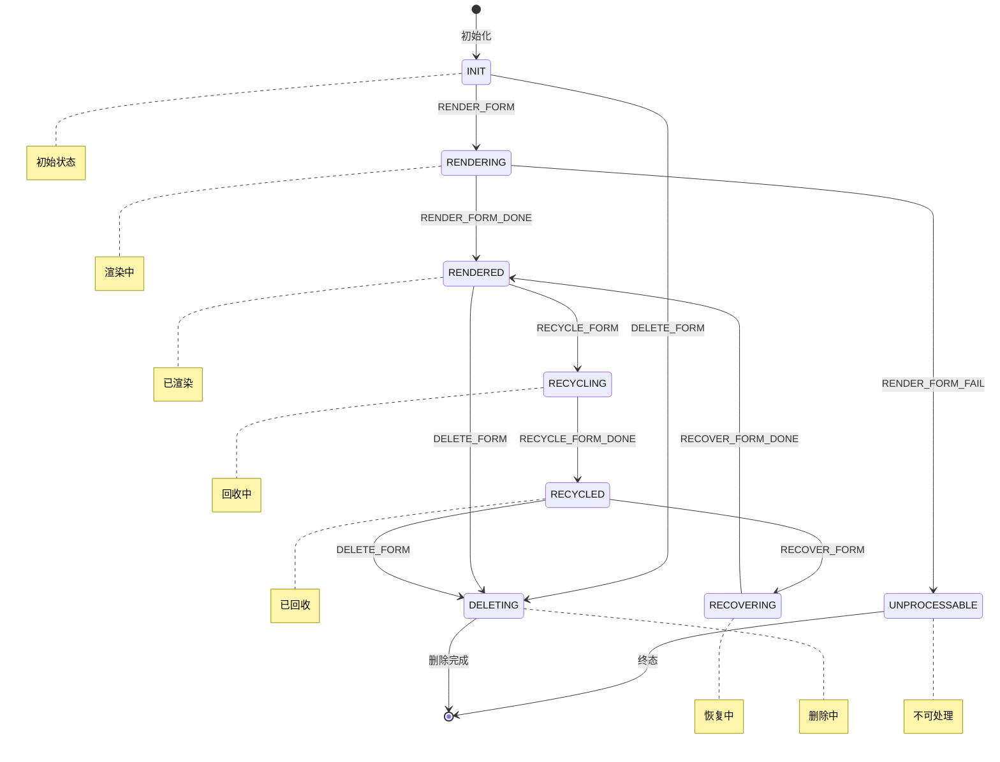

# 卡片管理服务 (Form Framework Services) 详细文档

## 目录

- [概述](#概述)
- [目录结构](#目录结构)
- [各子模块详细分析](#各子模块详细分析)
- [模块依赖关系](#模块依赖关系)

## 概述

Form Framework Services（FMS） 是 HarmonyOS 系统中卡片管理服务的核心实现，负责管理系统中所添加卡片的常驻代理服务。该服务作为 SystemAbility 运行，提供卡片的完整生命周期管理功能，包括卡片的添加、删除、更新、刷新、渲染等操作。

**核心职责**:
- 卡片生命周期管理（添加、删除、更新、刷新）
- 卡片渲染管理
- 状态机管理
- 数据持久化
- 与外部系统服务（AMS、BMS）交互
- 分布式卡片支持

## 目录结构

```
services/
├── config/                           # 配置文件管理
│   ├── form_config.xml               # 卡片配置文件
│   ├── form_xml_parser.cpp/h         # XML配置解析器
│   └── form_resource_param           # 资源参数配置
├── form_render_service/              # 卡片渲染服务 (独立进程 FRS)
│   ├── include/                      # 渲染服务头文件
│   ├── src/                          # 渲染服务源文件
│   └── FormRenderService/            # HAP应用入口
├── include/                          # 核心服务头文件
└── src/                              # 核心服务源文件
    ├── ams_mgr/                      # 应用管理服务ability manager service（AMS）相关接口
    ├── bms_mgr/                      # 应用包管理服务bundle manager service（BMS）相关接口
    ├── common/                       # 公共工具实现
    ├── data_center/                  # 数据中心实现
    ├── feature/                      # 特性功能实现    
    │   ├── bundle_distributed/       # 独立卡片包管理
    │   ├── bundle_forbidden/         # 健康管控手机特性
    │   ├── bundle_lock/              # 应用锁特性
    │   ├── ecological_rule/          # 生态规则管控特性
    │   ├── form_check/               # 卡片校验特性
    │   ├── form_share/               # 卡片分享特性 (日落)
    │   ├── memory_mgr/               # 卡片内存管理特性  
    │   ├── param_update/             # 卡片云端数据更新特性
    │   ├── route_proxy/              # 卡片路由代理特性
    │   └── theme_form/               # 主题卡片特性
    ├── form_host/                    # 卡片使用方管理实现
    ├── form_mgr/                     # 卡片管理服务核心实现
    ├── form_observer/                # 观察者实现
    ├── form_provider/                # 卡片提供方实现
    ├── form_refresh/                 # 刷新管理实现
    ├── form_render/                  # 渲染管理实现
    └── status_mgr_center/            # 状态管理实现
```

## 各子模块详细分析

#### FormMgrService (services/src/form_mgr/form_mgr_service.cpp)
- 系统能力服务（SystemAbility ID: 403）
- 继承自 FormMgrStub，实现 IFormMgr 接口
- 职责：
  - 处理来自应用侧的卡片管理请求
  - 协调各个管理器完成业务逻辑
  - 管理卡片生命周期

#### FormDataMgr (services/src/data_center/form_data_mgr.cpp)
- 单例模式（DelayedRefSingleton）
- 职责：
  - 管理内存中的卡片记录和主机记录
  - 负责卡片 ID 的生成和管理
  - 处理卡片数据的持久化

#### FormProviderMgr (services/src/form_provider/form_provider_mgr.cpp)
- 单例模式（DelayedRefSingleton）
- 职责：
  - 管理与卡片提供方的通信
  - 处理卡片的获取、更新、刷新等请求
  - 管理与提供方的连接生命周期

#### FormHostRecord (services/src/form_host/form_host_record.cpp)
- 职责：
  - 表示一个持有卡片的使用方
  - 管理使用方与卡片的关系
  - 处理使用方的死亡通知

#### FormRefreshMgr (services/src/form_refresh/form_refresh_mgr.cpp)
- 职责：管理卡片的刷新机制
- 支持 9 种刷新类型：
  - TYPE_HOST: 主机主动刷新
  - TYPE_NETWORK: 网络连接后刷新
  - TYPE_NEXT_TIME: 指定时间刷新
  - TYPE_TIMER: 定时刷新
  - TYPE_DATA: 数据变化刷新
  - TYPE_FORCE: 强制刷新
  - TYPE_UNCONTROL: 非控制刷新后刷新
  - TYPE_APP_UPGRADE: 应用升级后刷新
  - TYPE_PROVIDER: 提供方刷新

#### FormStatusMgr (services/src/status_mgr_center/form_status_mgr.cpp)
- 职责：有限状态机管理卡片生命周期状态
- 卡片状态（FormFsmStatus）：
  - INIT: 初始状态
  - RENDERED: 已渲染
  - RECYCLED: 已回收
  - RENDERING: 渲染中
  - RECYCLING_DATA: 回收数据中
  - RECYCLING: 回收中
  - RECOVERING: 恢复中
  - DELETING: 删除中
  - UNPROCESSABLE: 不可处理

#### FormRenderMgr (services/src/form_render/form_render_mgr.cpp)
- 职责：管理卡片渲染服务的连接和生命周期
- 与 FormRenderService（FRS）通信

#### 连接类

FormMgrService 通过多种 Connection 类与外部服务通信：
- FormAcquireConnection (services/src/form_provider/connection/form_acquire_connection.cpp) - 获取卡片连接
- FormRenderConnection (services/src/form_render/form_render_connection.cpp) - 渲染服务连接
- FormDeleteConnection - 删除连接
- FormUpdateSizeConnection - 更新尺寸连接
- FormMsgEventConnection - 消息事件连接
- 等多种专用连接类

### 状态管理机制

#### 有限状态机 (FSM)

FormStatusMgr 使用有限状态机管理卡片生命周期：



#### 事件队列机制

每个卡片有独立的事件队列 (FormEventQueue)：
- `PROCESS_TASK_DIRECT` - 直接处理任务
- `ADD_TASK_TO_QUEUE_UNIQUE` - 去重加入队列
- `ADD_TASK_TO_QUEUE_PUSH` - 直接推入队列
- `ADD_TASK_TO_QUEUE_DELETE` - 删除任务加入队列
- `PROCESS_TASK_FROM_QUEUE` - 从队列处理任务
- `PROCESS_TASK_RETRY` - 从重试队列处理

### 刷新机制

#### 刷新架构

FormRefreshMgr 使用策略模式，根据刷新类型选择不同的实现类：
- FormHostRefreshImpl (TYPE_HOST)
- FormNetConnRefreshImpl (TYPE_NETWORK)
- FormNextTimeRefreshImpl (TYPE_NEXT_TIME)
- FormTimerRefreshImpl (TYPE_TIMER)
- FormDataRefreshImpl (TYPE_DATA)
- FormForceRefreshImpl (TYPE_FORCE)
- FormRefreshAfterUncontrolImpl (TYPE_UNCONTROL)
- FormAppUpgradeRefreshImpl (TYPE_APP_UPGRADE)
- FormProviderRefreshImpl (TYPE_PROVIDER)

#### 模板方法模式

BaseFormRefresh 使用模板方法模式定义刷新流程：

```cpp
int BaseFormRefresh::RefreshFormRequest(RefreshData &data) {
    // 1. 构建检查因子
    CheckValidFactor factor = BuildCheckFactor(data);

    // 2. 执行控制检查
    int ret = DoControlCheck(data);
    if (ret != ERR_CONTINUE_REFRESH) {
        return ret;
    }

    // 3. 执行实际刷新
    return DoRefresh(data);
}
```

#### 刷新检查机制

- RefreshCheckMgr - 刷新检查管理器
- RefreshControlMgr - 刷新控制管理器
- RefreshCacheMgr - 刷新缓存管理器

检查内容包括：
- 卡片状态检查
- 可见性检查
- 权限检查
- 网络状态检查
- 资源状态检查


## 模块依赖关系

### 模块间依赖关系

1. **FormMgrService** 依赖:
   - FormDataMgr: 数据管理
   - FormProviderMgr: 提供方管理
   - FormRefreshMgr: 刷新管理
   - FormRenderMgr: 渲染管理
   - FormStatusMgr: 状态管理

2. **FormDataMgr** 依赖:
   - FormInfoMgr: 信息管理
   - FormRdbDataMgr: 数据持久化

3. **FormProviderMgr** 依赖:
   - FormAmsHelper: Ability连接
   - FormBmsHelper: Bundle信息

4. **FormRefreshMgr** 依赖:
   - FormDataMgr: 获取卡片信息
   - FormProviderMgr: 调用提供方刷新

5. **FormRenderMgr** 依赖:
   - FormRenderServiceMgr: 跨进程调用渲染服务

6. **FormStatusMgr** 依赖:
   - FormDataMgr: 状态管理
   - FormRefreshMgr: 状态驱动的刷新
   - FormRenderMgr: 状态驱动的渲染